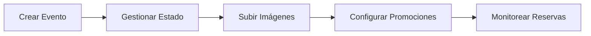
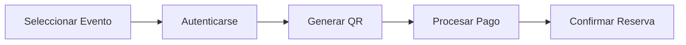
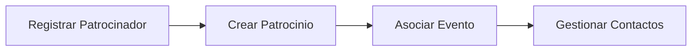
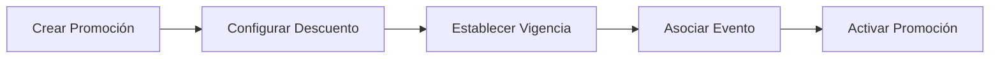
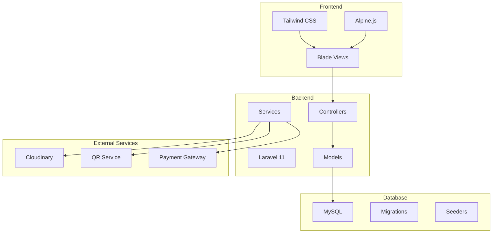
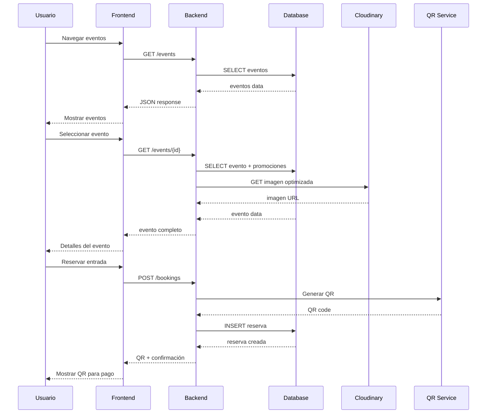

# 📚 Documentación Tecno Believe

Bienvenido a la documentación completa del sistema de gestión de eventos **Tecno Believe**. Esta documentación está organizada por audiencia y tipo de contenido para facilitar la navegación.

## 🎯 Navegación Rápida

### 👨‍💼 **Para Administradores**
- 📅 [Gestión de Eventos](admin/events.md) - Guía completa para crear y gestionar eventos
- 🏢 [Gestión de Patrocinadores](admin/sponsors.md) - Administración de patrocinadores y patrocinios
- 🎁 [Sistema de Promociones](admin/promotions.md) - Crear y gestionar descuentos
- 👥 [Gestión de Usuarios](admin/users.md) - Administración de cuentas de usuario

### 👨‍💻 **Para Desarrolladores**
- 🏗️ [Arquitectura del Sistema](dev/architecture.md) - Diagramas y patrones de diseño
- 🔌 [Documentación de API](dev/api.md) - Endpoints y ejemplos de integración
- 🧩 [Componentes Personalizados](dev/components.md) - Guía de componentes reutilizables
- 🧪 [Testing](dev/testing.md) - Estrategias y casos de prueba

### 👤 **Para Usuarios Finales**
- 🔐 [Registro y Autenticación](user/auth.md) - Cómo crear cuenta e iniciar sesión
- 🎫 [Reservas y Pagos](user/bookings.md) - Guía completa de reservas y pagos QR
- 📱 [Pagos con QR](user/payments.md) - Tutorial detallado del sistema de pagos

## 📖 Documentación por Módulos

### 🎯 **Módulo de Eventos**


**Documentación relacionada:**
- [Gestión de Eventos](admin/events.md)
- [API de Eventos](dev/api.md#endpoints-de-eventos)
- [Arquitectura de Eventos](dev/architecture.md#módulo-de-eventos)

### 🎫 **Módulo de Reservas**


**Documentación relacionada:**
- [Guía de Reservas](user/bookings.md)
- [API de Reservas](dev/api.md#endpoints-de-reservas)
- [Flujo de Pagos](dev/architecture.md#flujo-de-pago-con-qr)

### 🏢 **Módulo de Patrocinadores**


**Documentación relacionada:**
- [Gestión de Patrocinadores](admin/sponsors.md)
- [API de Patrocinadores](dev/api.md#endpoints-de-patrocinadores)

### 🎁 **Módulo de Promociones**


**Documentación relacionada:**
- [Sistema de Promociones](admin/promotions.md)
- [API de Promociones](dev/api.md#endpoints-de-promociones)

## 🛠️ Guías de Instalación y Configuración

### 🚀 **Instalación Rápida**
```bash
# 1. Clonar repositorio
git clone https://github.com/tu-usuario/tecno-believe.git
cd tecno-believe

# 2. Instalar dependencias
composer install
npm install

# 3. Configurar entorno
cp .env.example .env
php artisan key:generate

# 4. Configurar base de datos
php artisan migrate
php artisan db:seed

# 5. Crear enlace de storage
php artisan storage:link

# 6. Compilar assets
npm run build

# 7. Iniciar servidor
php artisan serve
```

### ⚙️ **Configuración Avanzada**
- [Variables de Entorno](../README.md#configuración-avanzada)
- [Configuración de Cloudinary](../README.md#configurar-cloudinary)
- [Configuración de Base de Datos](../README.md#configurar-base-de-datos)

## 📊 Diagramas del Sistema

### **Arquitectura General**


### **Flujo de Datos Principal**


## 🔧 Herramientas y Tecnologías

### **Stack Tecnológico**
| Categoría | Tecnología | Versión | Propósito |
|-----------|------------|---------|-----------|
| **Backend** | Laravel | 11.45.1 | Framework PHP |
| **Frontend** | Tailwind CSS | 3.0 | Framework CSS |
| **Database** | MySQL | 8.0 | Base de datos |
| **Storage** | Cloudinary | Latest | Gestión de imágenes |
| **Auth** | Laravel Sanctum | Latest | Autenticación API |
| **UI** | Alpine.js | Latest | Interactividad |
| **Icons** | Font Awesome | 6.0 | Iconografía |

### **Herramientas de Desarrollo**
- **Composer** - Gestor de dependencias PHP
- **NPM** - Gestor de dependencias JavaScript
- **Vite** - Bundler de assets
- **Git** - Control de versiones
- **PHPUnit** - Testing framework
- **Laravel Telescope** - Debugging (desarrollo)

## 📝 Convenciones y Estándares

### **Código PHP**
- Seguir **PSR-12** para estilo de código
- Usar **camelCase** para métodos
- Usar **snake_case** para propiedades de base de datos
- Documentar todas las funciones públicas

### **Código JavaScript**
- Usar **ES6+** features
- Seguir **ESLint** rules
- Usar **camelCase** para variables y funciones
- Comentar lógica compleja

### **Base de Datos**
- Usar **migraciones** para cambios de esquema
- Nombrar tablas en **plural** y **snake_case**
- Usar **foreign keys** para relaciones
- Crear **índices** para consultas frecuentes

### **Git**
- Usar **conventional commits**
- Crear **branches** por feature
- Hacer **pull requests** para cambios importantes
- Mantener **historial limpio**

## 🧪 Testing y Calidad

### **Tipos de Tests**
- **Unit Tests** - Lógica de negocio
- **Feature Tests** - Funcionalidades completas
- **Browser Tests** - Interfaz de usuario
- **API Tests** - Endpoints de API

### **Comandos de Testing**
```bash
# Ejecutar todos los tests
php artisan test

# Tests con coverage
php artisan test --coverage

# Tests específicos
php artisan test --filter EventTest

# Tests de browser
php artisan dusk
```

### **Métricas de Calidad**
- **Code Coverage** > 80%
- **PHPStan Level** 8
- **ESLint** sin errores
- **Performance** < 2s carga inicial

## 📞 Soporte y Contacto

### **Canales de Soporte**
- 📧 **Email**: soporte@tecnobelieve.com
- 📱 **WhatsApp**: +591 XXXXXXXX
- 💬 **Discord**: [Servidor de Desarrollo](https://discord.gg/tecnobelieve)
- 🐛 **Issues**: [GitHub Issues](https://github.com/tu-usuario/tecno-believe/issues)

### **Horarios de Atención**
- **Lunes a Viernes**: 9:00 - 18:00 (BOT)
- **Sábados**: 9:00 - 14:00 (BOT)
- **Emergencias**: 24/7 (solo producción)

### **Escalación de Issues**
1. **Nivel 1**: Soporte técnico general
2. **Nivel 2**: Desarrolladores senior
3. **Nivel 3**: Arquitecto de sistemas
4. **Nivel 4**: CTO

## 🔄 Actualizaciones y Changelog

### **Versiones Recientes**
- **v2.0.0** (2024-12-15) - Rediseño completo + QR payments
- **v1.5.0** (2024-11-01) - Sistema de promociones
- **v1.4.0** (2024-10-15) - Integración Cloudinary
- **v1.3.0** (2024-09-30) - Mejoras de UI/UX

### **Roadmap**
- **v2.1.0** - Notificaciones push
- **v2.2.0** - App móvil
- **v2.3.0** - Analytics avanzados
- **v3.0.0** - Microservicios

## 📚 Recursos Adicionales

### **Enlaces Útiles**
- [Laravel Documentation](https://laravel.com/docs)
- [Tailwind CSS Docs](https://tailwindcss.com/docs)
- [Cloudinary Docs](https://cloudinary.com/documentation)
- [Alpine.js Guide](https://alpinejs.dev/start-here)

### **Tutoriales y Guías**
- [Configuración de Desarrollo](../README.md#instalación-y-configuración)
- [Deployment en Producción](../README.md#deployment)
- [Mejores Prácticas](admin/events.md#mejores-prácticas)
- [Solución de Problemas](admin/events.md#solución-de-problemas)

---

**¡Gracias por usar Tecno Believe! 🎉**

Esta documentación está en constante evolución. Si encuentras algún error o tienes sugerencias de mejora, no dudes en contactarnos o crear un issue en GitHub. 