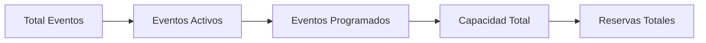
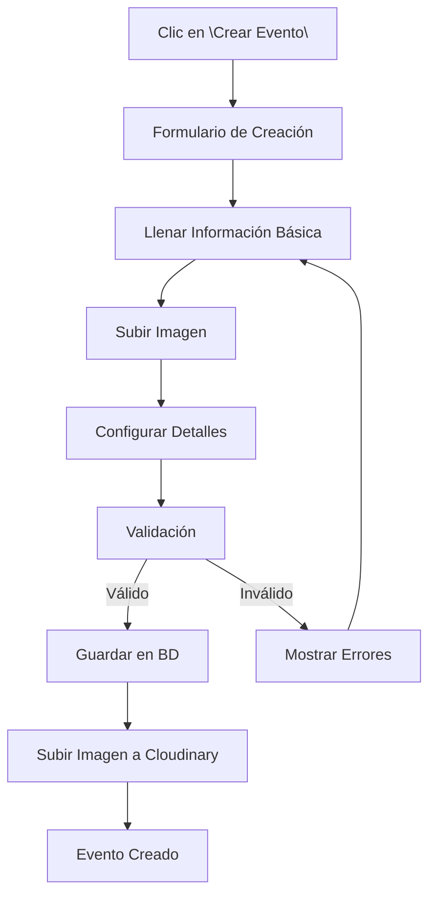
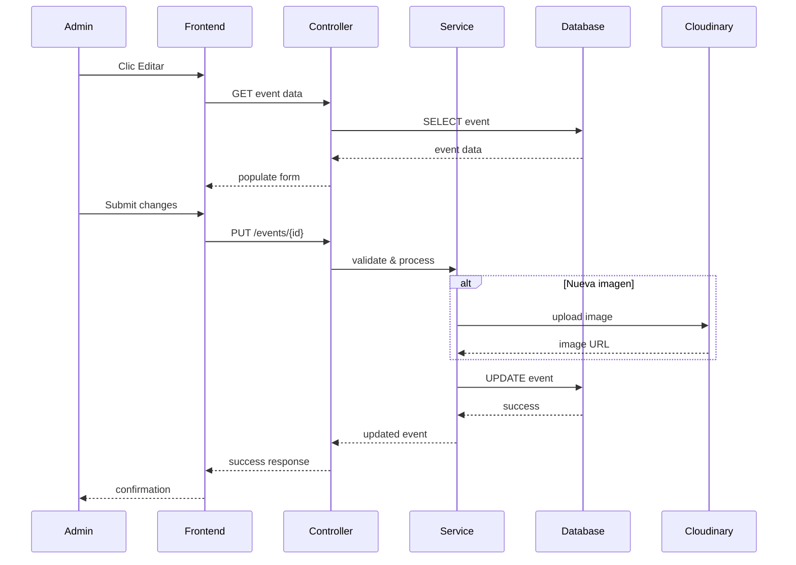
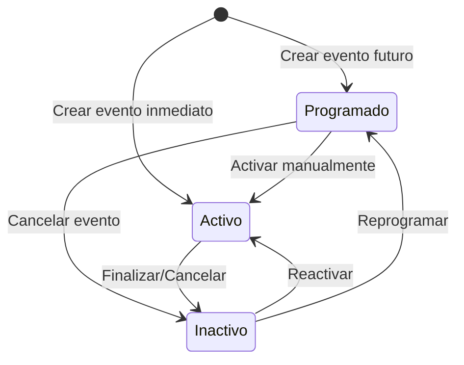
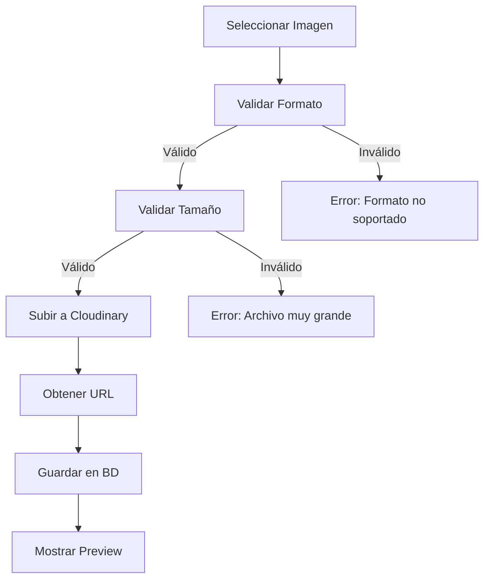
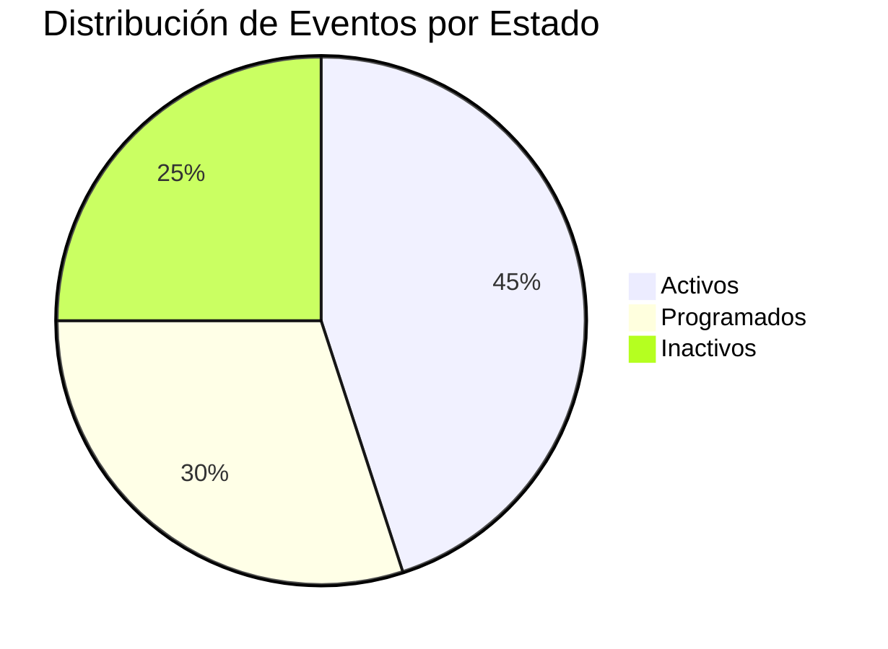

# 🎯 Gestión de Eventos - Guía para Administradores

## 📋 Índice
- [Visión General](#visión-general)
- [Acceso al Panel](#acceso-al-panel)
- [Dashboard de Eventos](#dashboard-de-eventos)
- [Crear Eventos](#crear-eventos)
- [Editar Eventos](#editar-eventos)
- [Gestión de Estados](#gestión-de-estados)
- [Gestión de Imágenes](#gestión-de-imágenes)
- [Reportes y Estadísticas](#reportes-y-estadísticas)
- [Mejores Prácticas](#mejores-prácticas)

## 🎯 Visión General

El módulo de gestión de eventos es el corazón del sistema Tecno Believe. Permite a los administradores crear, editar, eliminar y gestionar todos los aspectos de los eventos, incluyendo:

- ✅ **Información básica** (nombre, descripción, ubicación)
- ✅ **Detalles técnicos** (capacidad, precio, fecha/hora)
- ✅ **Estados del evento** (Activo, Programado, Inactivo)
- ✅ **Gestión de imágenes** con Cloudinary
- ✅ **Estadísticas en tiempo real**
- ✅ **Integración con reservas y promociones**

## 🔐 Acceso al Panel

### **Requisitos de Acceso**
- ✅ Cuenta de usuario con rol `admin`
- ✅ Autenticación activa
- ✅ Permisos de administración

### **URL de Acceso**
```
https://tu-dominio.com/events
```

### **Navegación**
```
Dashboard → Eventos → Gestión de Eventos
```

## 📊 Dashboard de Eventos

### **Estadísticas Principales**
El dashboard muestra métricas clave en tiempo real:



#### **Tarjetas de Estadísticas**
1. **📅 Total de Eventos**
   - Contador total de eventos en el sistema
   - Incluye todos los estados

2. **🟢 Eventos Activos**
   - Eventos con estado "Activo"
   - Disponibles para reservas

3. **🟡 Eventos Programados**
   - Eventos con estado "Programado"
   - Próximos a activarse

4. **👥 Capacidad Total**
   - Suma de capacidades de todos los eventos
   - Indicador de escala del sistema

### **Vista de Lista**
La tabla de eventos muestra:
- **Imagen del evento** (thumbnail)
- **Nombre y descripción**
- **Fecha y hora**
- **Ubicación**
- **Capacidad y precio**
- **Estado** (badge colorizado)
- **Acciones** (editar, eliminar)

## ➕ Crear Eventos

### **Proceso de Creación**


### **Campos Obligatorios**
| Campo | Tipo | Validación | Descripción |
|-------|------|------------|-------------|
| **Nombre** | `string` | `required\|max:255` | Nombre del evento |
| **Descripción** | `text` | `required` | Descripción detallada |
| **Capacidad** | `integer` | `required\|min:1` | Número máximo de asistentes |
| **Precio** | `decimal` | `required\|min:0` | Precio de entrada en Bs. |
| **Fecha** | `date` | `required\|date` | Fecha del evento |
| **Hora** | `time` | `required` | Hora de inicio |
| **Ubicación** | `string` | `required\|max:255` | Lugar del evento |
| **Estado** | `enum` | `required` | Activo/Programado/Inactivo |
| **Imagen** | `file` | `image\|max:2048` | Imagen promocional |

### **Ejemplo de Creación**
```php
// Datos del formulario
$eventData = [
    'nombre' => 'Concierto de Rock 2024',
    'descripcion' => 'Gran concierto con las mejores bandas locales',
    'capacidad' => 500,
    'precio_entrada' => 150.00,
    'fecha' => '2024-12-25',
    'hora' => '20:00',
    'ubicacion' => 'Auditorio Municipal',
    'estado' => 'Programado',
    'imagen' => $uploadedFile
];
```

### **Validaciones Especiales**
- ✅ **Fecha futura**: No se pueden crear eventos en fechas pasadas
- ✅ **Capacidad mínima**: Al menos 1 persona
- ✅ **Precio válido**: No puede ser negativo
- ✅ **Imagen opcional**: Si no se sube, se usa imagen por defecto

## ✏️ Editar Eventos

### **Acceso a Edición**
- Clic en el botón **"Editar"** (icono de lápiz) en la lista
- Se abre modal con formulario pre-llenado
- Todos los campos son editables

### **Campos Editables**
Todos los campos del evento pueden ser modificados:
- ✅ Información básica
- ✅ Detalles técnicos
- ✅ Estado del evento
- ✅ Imagen (opcional)

### **Proceso de Edición**


### **Consideraciones Especiales**
- 🔄 **Imagen existente**: Se mantiene si no se sube nueva
- 🔄 **Reservas activas**: Se valida impacto en reservas existentes
- 🔄 **Promociones**: Se actualizan automáticamente

## 🔄 Gestión de Estados

### **Estados Disponibles**
| Estado | Color | Descripción | Acciones Permitidas |
|--------|-------|-------------|-------------------|
| **🟢 Activo** | Verde | Evento disponible para reservas | Reservar, Editar, Desactivar |
| **🟡 Programado** | Amarillo | Evento futuro, no disponible aún | Editar, Activar, Cancelar |
| **🔴 Inactivo** | Rojo | Evento cancelado o finalizado | Editar, Reactivar |

### **Transiciones de Estado**


### **Reglas de Negocio**
- ✅ **Eventos Activos**: Permiten nuevas reservas
- ✅ **Eventos Programados**: No permiten reservas hasta activación
- ✅ **Eventos Inactivos**: No permiten nuevas reservas
- ✅ **Cambio automático**: Los eventos programados pueden activarse automáticamente en su fecha

## 🖼️ Gestión de Imágenes

### **Integración con Cloudinary**
El sistema utiliza Cloudinary para gestión optimizada de imágenes:

#### **Características**
- ✅ **Subida automática** a CDN
- ✅ **Optimización automática** de tamaño y calidad
- ✅ **Transformaciones dinámicas**
- ✅ **URLs seguras** y permanentes
- ✅ **Backup automático**

#### **Formatos Soportados**
- `JPEG` (.jpg, .jpeg)
- `PNG` (.png)
- `GIF` (.gif)
- `SVG` (.svg)

#### **Limitaciones**
- **Tamaño máximo**: 2MB por imagen
- **Dimensiones recomendadas**: 1200x800px
- **Relación de aspecto**: 3:2 (recomendado)

### **Proceso de Subida**


### **Mejores Prácticas para Imágenes**
1. **📐 Dimensiones**: Usar imágenes de alta resolución (min. 800x600)
2. **🎨 Calidad**: Preferir JPEG para fotos, PNG para gráficos
3. **📱 Responsive**: Las imágenes se adaptan automáticamente
4. **⚡ Performance**: Cloudinary optimiza automáticamente
5. **🔒 Seguridad**: URLs firmadas para protección

## 📈 Reportes y Estadísticas

### **Métricas Disponibles**
El sistema proporciona análisis detallados:

#### **1. Estadísticas Generales**
```sql
-- Eventos por estado
SELECT estado, COUNT(*) as total 
FROM eventos 
GROUP BY estado;

-- Capacidad total vs reservas
SELECT 
    SUM(capacidad) as capacidad_total,
    COUNT(reservas.id) as reservas_totales
FROM eventos 
LEFT JOIN reservas ON eventos.id = reservas.evento_id;
```

#### **2. Análisis de Performance**
- 📊 **Eventos más populares** (por número de reservas)
- 📊 **Ingresos por evento**
- 📊 **Ocupación promedio**
- 📊 **Tendencias temporales**

#### **3. Reportes Exportables**
- 📄 **PDF**: Lista completa de eventos
- 📊 **Excel**: Datos para análisis
- 📈 **Gráficos**: Visualizaciones interactivas

### **Dashboard Analytics**


## 💡 Mejores Prácticas

### **🎯 Creación de Eventos**
1. **Planificación anticipada**: Crear eventos con al menos 2 semanas de antelación
2. **Información completa**: Llenar todos los campos con detalle
3. **Imágenes atractivas**: Usar fotos de alta calidad y relevantes
4. **Precios competitivos**: Investigar mercado antes de fijar precios
5. **Capacidad realista**: Considerar limitaciones del venue

### **📝 Descripciones Efectivas**
```markdown
# Ejemplo de buena descripción:
🎵 Gran Concierto de Rock 2024

Únete a nosotros para una noche inolvidable con las mejores bandas locales:
• Banda Principal: Los Rockeros
• Banda Invitada: Metal Force
• Hora de inicio: 20:00
• Duración aproximada: 3 horas

Incluye:
✅ Entrada general
✅ Acceso a zona de food trucks
✅ Estacionamiento gratuito

¡No te pierdas este evento único!
```

### **🔄 Gestión de Estados**
1. **Programado → Activo**: Activar 1-2 semanas antes del evento
2. **Monitoreo continuo**: Revisar reservas diariamente
3. **Comunicación**: Notificar cambios a usuarios registrados
4. **Backup plan**: Tener plan de contingencia para cancelaciones

### **📊 Optimización de Performance**
1. **Imágenes optimizadas**: Usar Cloudinary para mejor rendimiento
2. **Cache inteligente**: El sistema cachea automáticamente
3. **Monitoreo**: Revisar métricas regularmente
4. **Feedback**: Recopilar opiniones de usuarios

### **🔒 Seguridad y Backup**
1. **Backup regular**: Los datos se respaldan automáticamente
2. **Validación estricta**: Todos los inputs son validados
3. **Logs de auditoría**: Todas las acciones quedan registradas
4. **Acceso controlado**: Solo administradores pueden gestionar eventos

## 🚨 Solución de Problemas

### **Problemas Comunes**

#### **1. Error al subir imagen**
```
Error: "The image field must be an image."
```
**Solución**: Verificar que el archivo sea una imagen válida (JPG, PNG, GIF, SVG)

#### **2. Evento no aparece en lista pública**
**Causa**: Estado "Programado" o "Inactivo"
**Solución**: Cambiar estado a "Activo"

#### **3. Error de validación de fecha**
```
Error: "The fecha field must be a date after today."
```
**Solución**: Seleccionar una fecha futura

#### **4. Problema con capacidad**
```
Error: "The capacidad field must be at least 1."
```
**Solución**: Ingresar un número mayor a 0

### **Contacto de Soporte**
- 📧 **Email**: admin@tecnobelieve.com
- 📱 **WhatsApp**: +591 XXXXXXXX
- 🕐 **Horario**: Lunes a Viernes, 9:00 - 18:00

---

Esta guía proporciona todo lo necesario para gestionar eventos de manera eficiente en el sistema Tecno Believe. Para más información, consulta la documentación técnica o contacta al equipo de soporte. 
