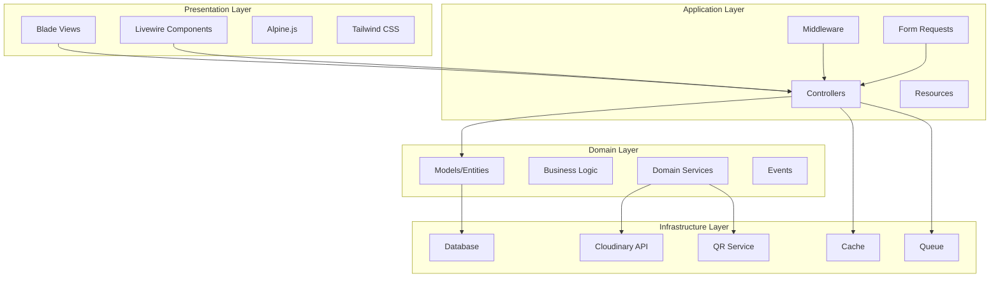
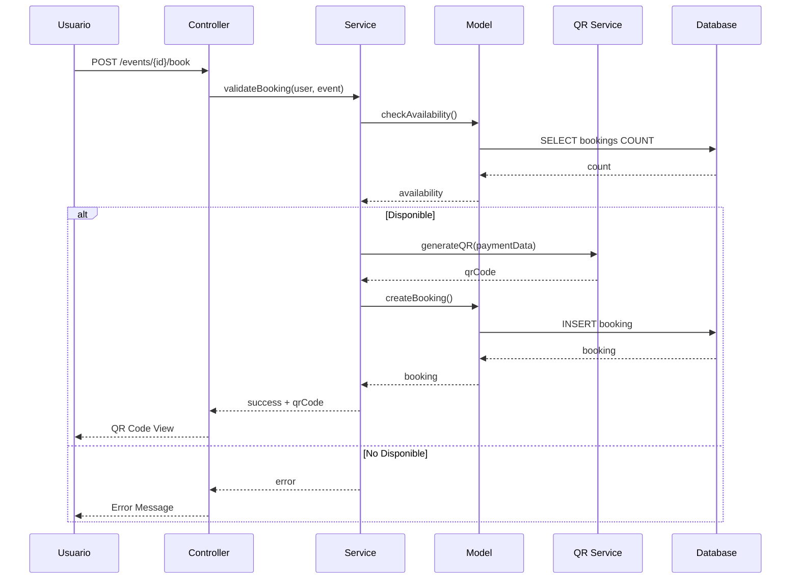
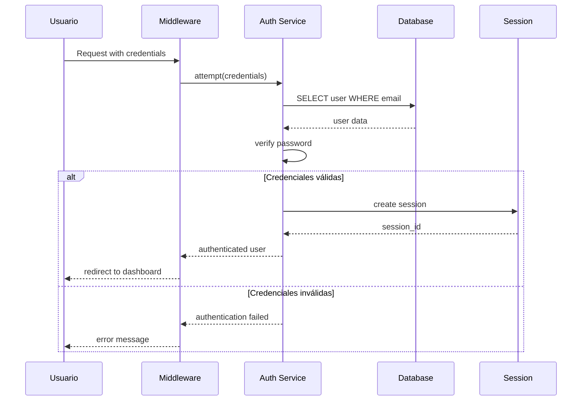
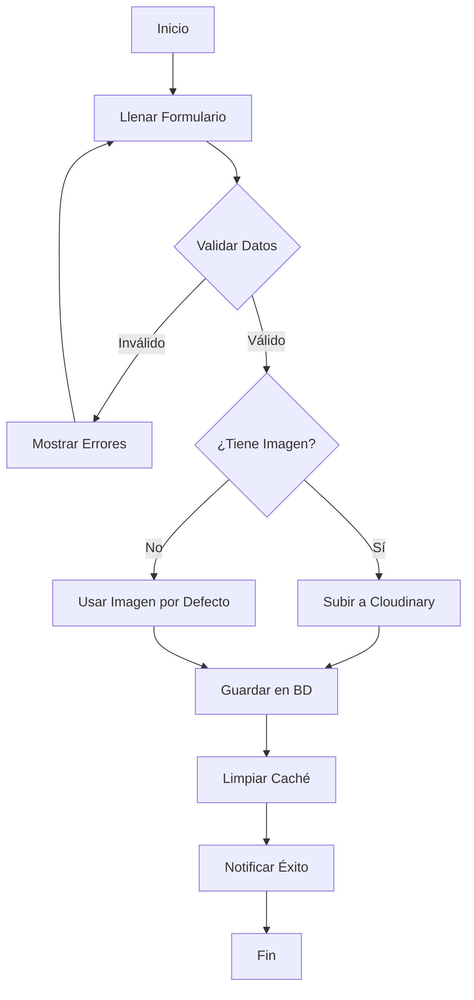
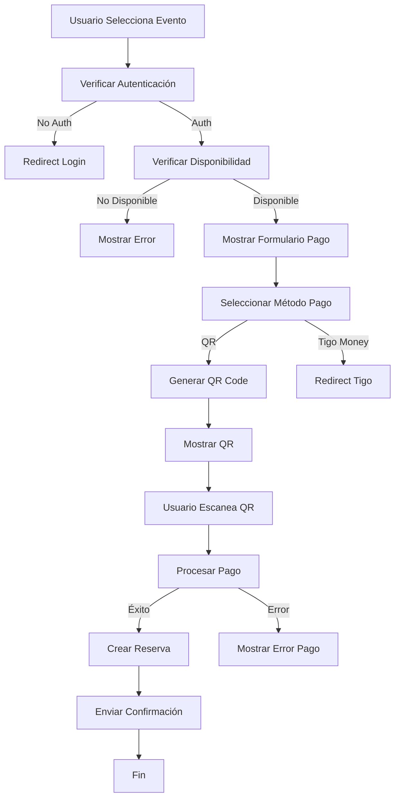
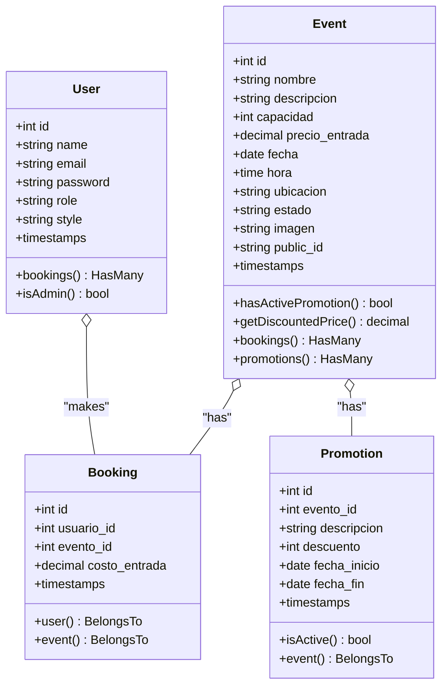
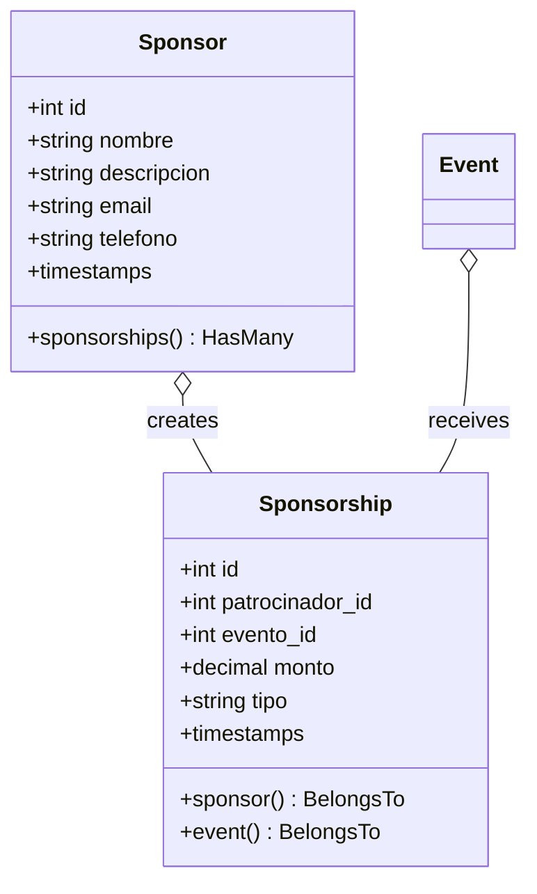
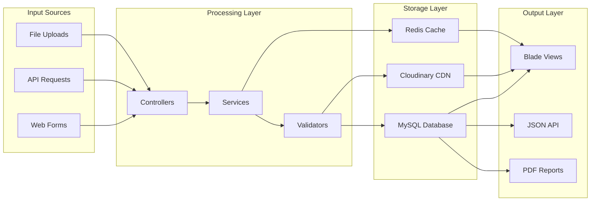
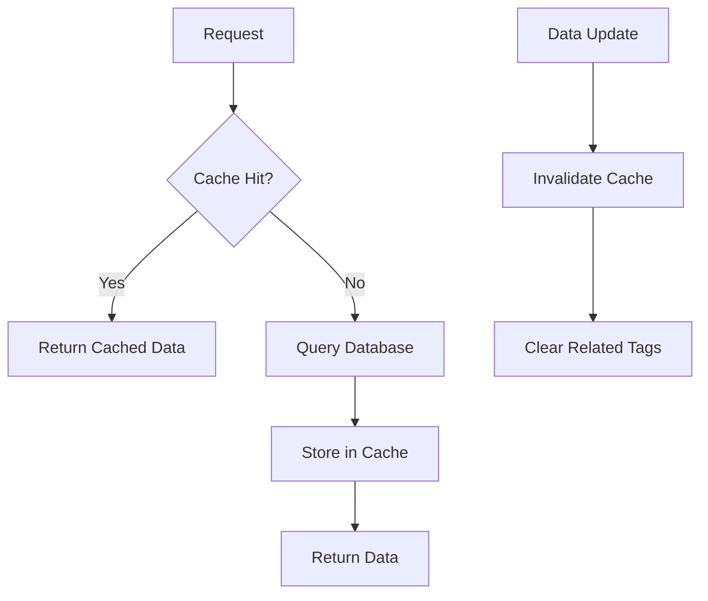
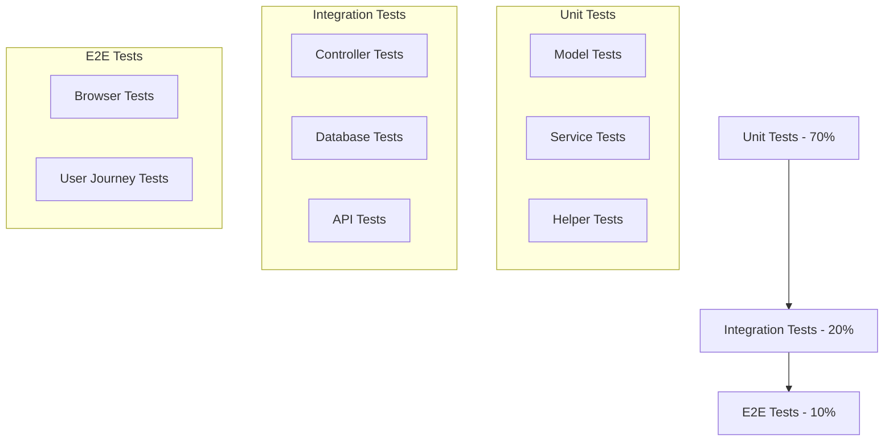

# 🏗️ Arquitectura del Sistema - Tecno Believe

## 📋 Índice
- [Visión General](#visión-general)
- [Arquitectura de Capas](#arquitectura-de-capas)
- [Patrones de Diseño](#patrones-de-diseño)
- [Diagramas de Secuencia](#diagramas-de-secuencia)
- [Diagramas de Actividad](#diagramas-de-actividad)
- [Diagramas de Clases](#diagramas-de-clases)
- [Flujo de Datos](#flujo-de-datos)

## 🎯 Visión General

Tecno Believe está construido siguiendo una **arquitectura MVC (Model-View-Controller)** con Laravel 11, implementando principios de **Clean Architecture** y **SOLID**. El sistema está diseñado para ser escalable, mantenible y testeable.

### **Principios Arquitectónicos**
- ✅ **Separación de Responsabilidades**
- ✅ **Inversión de Dependencias**
- ✅ **Principio Abierto/Cerrado**
- ✅ **Single Responsibility Principle**
- ✅ **DRY (Don't Repeat Yourself)**

## 🏛️ Arquitectura de Capas



### **1. Capa de Presentación**
- **Blade Views**: Templates para renderizado HTML
- **Livewire Components**: Componentes reactivos
- **Alpine.js**: Interactividad del frontend
- **Tailwind CSS**: Estilos y diseño responsivo

### **2. Capa de Aplicación**
- **Controllers**: Lógica de control de flujo
- **Middleware**: Filtros de peticiones HTTP
- **Form Requests**: Validación de datos
- **Resources**: Transformación de datos para API

### **3. Capa de Dominio**
- **Models**: Entidades del negocio
- **Business Logic**: Reglas de negocio
- **Domain Services**: Servicios específicos del dominio
- **Events**: Eventos del sistema

### **4. Capa de Infraestructura**
- **Database**: Persistencia de datos
- **External APIs**: Servicios externos (Cloudinary, QR)
- **Cache**: Sistema de caché
- **Queue**: Cola de trabajos

## 🎨 Patrones de Diseño

### **1. Repository Pattern**
```php
interface EventRepositoryInterface
{
    public function findById(int $id): ?Event;
    public function findActive(): Collection;
    public function create(array $data): Event;
    public function update(Event $event, array $data): Event;
    public function delete(Event $event): bool;
}
```

### **2. Service Pattern**
```php
class EventService
{
    public function __construct(
        private EventRepositoryInterface $eventRepository,
        private ImageService $imageService
    ) {}
    
    public function createEvent(array $data): Event
    {
        if (isset($data['image'])) {
            $data['imagen'] = $this->imageService->upload($data['image']);
        }
        
        return $this->eventRepository->create($data);
    }
}
```

### **3. Observer Pattern**
```php
class EventObserver
{
    public function created(Event $event): void
    {
        // Notificar a usuarios suscritos
        NotifySubscribersJob::dispatch($event);
    }
    
    public function updated(Event $event): void
    {
        // Limpiar caché relacionado
        Cache::tags(['events'])->flush();
    }
}
```

## 🔄 Diagramas de Secuencia

### **Proceso de Reserva de Evento**


### **Proceso de Autenticación**


## 📊 Diagramas de Actividad

### **Flujo de Creación de Evento**


### **Flujo de Pago con QR**


## 🏗️ Diagramas de Clases

### **Módulo de Eventos**


### **Módulo de Patrocinadores**


## 🌊 Flujo de Datos

### **Arquitectura de Datos**


### **Flujo de Caché**


## 🔧 Configuración de Arquitectura

### **Service Providers**
```php
class AppServiceProvider extends ServiceProvider
{
    public function register(): void
    {
        $this->app->bind(
            EventRepositoryInterface::class,
            EventRepository::class
        );
        
        $this->app->bind(
            ImageServiceInterface::class,
            CloudinaryImageService::class
        );
    }
}
```

### **Middleware Stack**
```php
protected $middlewareGroups = [
    'web' => [
        \App\Http\Middleware\EncryptCookies::class,
        \Illuminate\Cookie\Middleware\AddQueuedCookiesToResponse::class,
        \Illuminate\Session\Middleware\StartSession::class,
        \Illuminate\View\Middleware\ShareErrorsFromSession::class,
        \App\Http\Middleware\VerifyCsrfToken::class,
        \Illuminate\Routing\Middleware\SubstituteBindings::class,
        \App\Http\Middleware\HandleInertiaRequests::class,
    ],
    
    'admin' => [
        'auth:sanctum',
        'verified',
        \App\Http\Middleware\CheckRole::class.':admin',
    ],
];
```

## 📈 Escalabilidad

### **Estrategias de Escalabilidad**
1. **Horizontal Scaling**: Load balancers + múltiples instancias
2. **Database Sharding**: Particionamiento por región/evento
3. **CDN Integration**: Cloudinary para assets estáticos
4. **Queue Workers**: Procesamiento asíncrono
5. **Redis Clustering**: Cache distribuido

### **Optimizaciones de Performance**
- **Eager Loading**: Prevenir N+1 queries
- **Database Indexing**: Índices optimizados
- **Query Optimization**: Consultas eficientes
- **Asset Optimization**: Minificación y compresión
- **HTTP Caching**: Headers de caché apropiados

## 🧪 Testing Architecture

### **Pirámide de Testing**


## 🔒 Seguridad

### **Capas de Seguridad**
1. **Authentication**: Laravel Sanctum
2. **Authorization**: Policies y Gates
3. **Input Validation**: Form Requests
4. **CSRF Protection**: Token verification
5. **SQL Injection**: Eloquent ORM
6. **XSS Protection**: Blade escaping

---

Esta arquitectura proporciona una base sólida para el crecimiento y mantenimiento del sistema Tecno Believe, siguiendo las mejores prácticas de desarrollo de software. 
