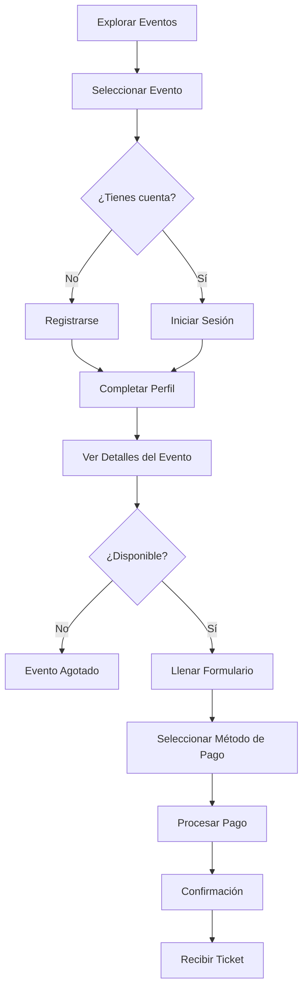
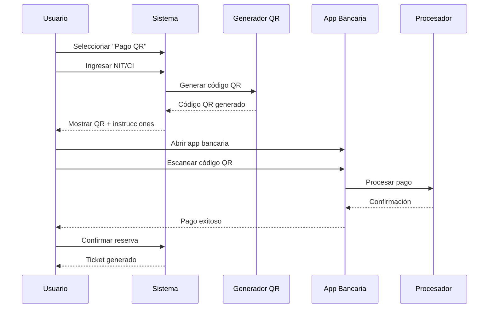

# 🎫 Guía de Reservas y Pagos - Tecno Believe

## 📋 Índice
- [Introducción](#introducción)
- [Proceso de Reserva](#proceso-de-reserva)
- [Métodos de Pago](#métodos-de-pago)
- [Pago con Código QR](#pago-con-código-qr)
- [Confirmación y Tickets](#confirmación-y-tickets)
- [Gestión de Reservas](#gestión-de-reservas)
- [Preguntas Frecuentes](#preguntas-frecuentes)
- [Soporte](#soporte)

## 🎯 Introducción

¡Bienvenido al sistema de reservas de Tecno Believe! Esta guía te ayudará a reservar entradas para tus eventos favoritos de manera rápida y segura. Nuestro sistema ofrece múltiples métodos de pago, incluyendo la innovadora tecnología de códigos QR.

### **¿Qué puedes hacer?**
- ✅ **Explorar eventos** disponibles
- ✅ **Reservar entradas** de forma segura
- ✅ **Pagar con QR** o Tigo Money
- ✅ **Gestionar tus reservas**
- ✅ **Recibir confirmaciones** instantáneas

## 🎫 Proceso de Reserva

### **Paso a Paso**


### **1. Explorar Eventos**
- Visita la página principal: `https://tecnobelieve.com`
- Navega por los eventos disponibles
- Usa filtros para encontrar eventos de tu interés

### **2. Seleccionar Evento**
- Haz clic en el evento que te interesa
- Revisa toda la información:
  - 📅 **Fecha y hora**
  - 📍 **Ubicación**
  - 💰 **Precio**
  - 👥 **Disponibilidad**
  - 🎁 **Promociones activas**

### **3. Autenticación**
Si no tienes cuenta, necesitarás registrarte:

#### **Registro Rápido**
```
📧 Email: tu@email.com
🔒 Contraseña: (mínimo 8 caracteres)
👤 Nombre completo
📱 Teléfono (opcional)
```

#### **Inicio de Sesión**
```
📧 Email: tu@email.com
🔒 Contraseña: tu_contraseña
```

## 💳 Métodos de Pago

### **Opciones Disponibles**

| Método | Descripción | Tiempo | Comisión |
|--------|-------------|--------|----------|
| **🔲 Código QR** | Pago con apps móviles | Instantáneo | Sin comisión |
| **📱 Tigo Money** | Billetera digital | 1-2 minutos | Según Tigo |

### **Información Requerida**
Para cualquier método de pago necesitarás:
- ✅ **NIT o CI**: Documento de identidad
- ✅ **Método de pago**: Seleccionar opción
- ✅ **Confirmación**: Verificar datos

## 📱 Pago con Código QR

### **¿Qué es el Pago QR?**
El pago con código QR es un método moderno y seguro que te permite pagar usando tu aplicación bancaria móvil favorita, simplemente escaneando un código.

### **Apps Compatibles**
- 🏦 **Banco Nacional de Bolivia (BNB)**
- 🏦 **Banco Mercantil Santa Cruz**
- 🏦 **Banco Económico**
- 🏦 **Banco Unión**
- 📱 **Tigo Money**
- 📱 **Otras apps bancarias**

### **Proceso Detallado**


### **Pasos para Pagar con QR**

#### **1. Generar Código QR**
- Completa el formulario de reserva
- Ingresa tu **NIT o CI**
- Selecciona **"Servicio QR"**
- Haz clic en **"Generar QR"**

#### **2. Información del QR**
El sistema te mostrará:
```
💰 Monto: Bs. 150.00
🎫 Evento: Concierto de Rock 2024
⏰ Válido por: 10 minutos
📱 Código QR: [Imagen del código]
```

#### **3. Escanear con tu App**
1. **Abre tu app bancaria** en el teléfono
2. **Busca la opción** "Pagar QR" o "Escanear QR"
3. **Apunta la cámara** hacia el código QR
4. **Confirma el monto** mostrado en tu app
5. **Autoriza el pago** con tu PIN/huella

#### **4. Confirmación**
- Tu app mostrará **"Pago exitoso"**
- Guarda el **comprobante** de tu app
- Regresa al navegador web
- Haz clic en **"Confirmar Reserva"**

### **Ventajas del Pago QR**
- ⚡ **Instantáneo**: Pago en segundos
- 🔒 **Seguro**: Encriptación bancaria
- 📱 **Conveniente**: Usa tu app favorita
- 💰 **Sin comisiones**: No hay cargos extra
- 📄 **Comprobante**: Recibo automático

### **Diseño del QR Mejorado**
Nuestro nuevo diseño incluye:

```
┌─────────────────────────────────────┐
│  📱 Código QR de Pago               │
│                                     │
│  [QR CODE]    💰 Monto: Bs. 150.00 │
│   384x384     🎫 Evento: Concierto  │
│               ⏰ Válido: 10 min     │
│                                     │
│  📋 Pasos para pagar:               │
│  1️⃣ Abre tu app de pagos           │
│  2️⃣ Escanea este código            │
│  3️⃣ Confirma el pago               │
│  4️⃣ Espera confirmación            │
└─────────────────────────────────────┘
```

## 🎫 Confirmación y Tickets

### **Proceso de Confirmación**
Después del pago exitoso:

1. **Confirmación inmediata** en pantalla
2. **Email de confirmación** (si proporcionaste email)
3. **Ticket digital** generado
4. **Código de reserva** único

### **Información del Ticket**
Tu ticket incluirá:
```
🎫 TICKET DIGITAL - TECNO BELIEVE
━━━━━━━━━━━━━━━━━━━━━━━━━━━━━━━━━━

🎵 Evento: Concierto de Rock 2024
📅 Fecha: 25 de Diciembre, 2024
🕐 Hora: 20:00
📍 Lugar: Auditorio Municipal
💰 Precio: Bs. 150.00

👤 Titular: Juan Pérez
📧 Email: juan@email.com
🆔 CI/NIT: 12345678

🔢 Código de Reserva: TB-2024-001234
📱 QR de Acceso: [QR Code]

━━━━━━━━━━━━━━━━━━━━━━━━━━━━━━━━━━
⚠️  Presenta este ticket en el evento
🔒 Código único - No transferible
```

### **Cómo Usar tu Ticket**
- 📱 **Guarda** el ticket en tu teléfono
- 🖨️ **Imprime** una copia (opcional)
- 🎫 **Presenta** en la entrada del evento
- 🔍 **Permite** que escaneen tu código QR

## 📋 Gestión de Reservas

### **Ver tus Reservas**
1. Inicia sesión en tu cuenta
2. Ve a **"Mis Reservas"** en el menú
3. Revisa todas tus reservas activas

### **Estados de Reserva**
| Estado | Descripción | Acciones |
|--------|-------------|----------|
| **✅ Confirmada** | Pago exitoso, ticket válido | Ver ticket, Cancelar* |
| **⏳ Pendiente** | Esperando confirmación de pago | Completar pago |
| **❌ Cancelada** | Reserva cancelada | Solicitar reembolso* |

*Sujeto a políticas de cancelación

### **Políticas de Cancelación**
- ✅ **Hasta 48 horas antes**: Reembolso completo
- ⚠️ **24-48 horas antes**: Reembolso del 50%
- ❌ **Menos de 24 horas**: Sin reembolso

## ❓ Preguntas Frecuentes

### **💳 Sobre Pagos**

**P: ¿Es seguro pagar con código QR?**
R: Sí, completamente seguro. Usamos la misma tecnología que los bancos para generar códigos QR encriptados.

**P: ¿Qué pasa si el código QR expira?**
R: Los códigos QR son válidos por 10 minutos. Si expira, simplemente genera uno nuevo.

**P: ¿Puedo pagar con cualquier banco?**
R: Sí, cualquier app bancaria que soporte pagos QR funcionará.

### **🎫 Sobre Reservas**

**P: ¿Puedo transferir mi ticket a otra persona?**
R: No, los tickets son nominales y no transferibles por seguridad.

**P: ¿Qué pasa si pierdo mi ticket?**
R: Puedes recuperarlo desde tu cuenta o contactar soporte con tu código de reserva.

**P: ¿Puedo cancelar mi reserva?**
R: Sí, sujeto a nuestras políticas de cancelación (ver arriba).

### **📱 Problemas Técnicos**

**P: El código QR no se genera**
R: Verifica tu conexión a internet y que hayas llenado todos los campos requeridos.

**P: Mi app no reconoce el QR**
R: Asegúrate de usar la función "Pagar QR" de tu app bancaria, no el lector de QR general.

**P: El pago se procesó pero no recibí confirmación**
R: Espera unos minutos. Si persiste, contacta soporte con tu comprobante de pago.

## 🆘 Soporte

### **Canales de Atención**
- 📧 **Email**: soporte@tecnobelieve.com
- 📱 **WhatsApp**: +591 XXXXXXXX
- 💬 **Chat en vivo**: Disponible en la web
- 📞 **Teléfono**: +591 XXXXXXXX

### **Horarios de Atención**
- 🕐 **Lunes a Viernes**: 9:00 - 18:00
- 🕐 **Sábados**: 9:00 - 14:00
- 🕐 **Domingos**: Solo emergencias

### **Información para Soporte**
Cuando contactes soporte, ten a mano:
- 🆔 **Código de reserva**
- 📧 **Email de registro**
- 📱 **Número de teléfono**
- 🧾 **Comprobante de pago** (si aplica)

### **Tiempo de Respuesta**
- 📧 **Email**: 2-4 horas
- 📱 **WhatsApp**: 15-30 minutos
- 💬 **Chat**: Inmediato
- 📞 **Teléfono**: Inmediato

---

¡Disfruta de tus eventos con Tecno Believe! 🎉

Para más información, visita nuestra [página de ayuda](https://tecnobelieve.com/help) o contacta nuestro equipo de soporte. 